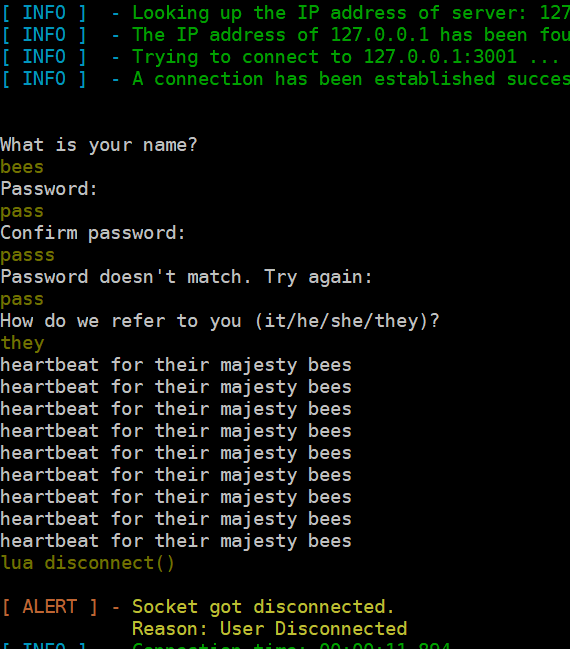

# fennel

Apparently I'm at the "building a MUD from scratch" stage of quarantine.

This is a learning exercise to write a MUD engine. I have the Merc 2.2 codebase
at hand as a rough guide. My Winamp playlist has taken me deep into 1990s Fiona
Apple. There will never be a better time to start.

## log::trace!("project thoughts")

### Networking

Step 0 of this project is simply getting a network connection, and since I am
mostly following the Diku/Merc codebase at this point, it's a mostly easy
affair.

After looking at how Diku/Merc shoehorns client connection into the game loop,
I decide to put the connection process in a separate loop in a separate thread,
and send over connected users through a channel. This is all new to me, and very
cool! ✨🧙‍♀️✨

One frustration: we're technically not telnet compliant yet, because we don't
respond to telnet control codes. There's a crate for this
([telnet](https://crates.io/crates/telnet)), but the structure it exposes isn't
`Send`, so I can't use it yet. I'll handle this later, possibly by pulling some
of `telnet`'s code right into the repo.

Anyway, thar she blows! 🐳

### Do I use linked lists?

The Diku codebase likes intrusive linked lists for everything. I was not a C
hacker in the early '90s, but I kind of understand the appeal: very easy
insertions, no need for a contiguous chunk of memory for an array of pointers,
etc. Lists of characters, objects, mobs, etc. get iterated once per game cycle,
but for random access the items' pointers are saved prior to insertion.

My 🦀 spider sense 🦀 has me thinking that Rust's borrow checker will have some
harsh things to say about that idea, and I don't even bother trying to replicate
Diku's pattern. No, it's gonna be
[generational-arena](https://crates.io/crates/generational-arena) instead.

### Async or not?

First design decision I had to make was what to do about the event loop.
Diku/Merc has a game loop that essentially runs a REPL about 4 times per second,
so input parsing, updating the game world, and then sending batched output to
users happens every 250ms in that loop.

The "REPL that advances at regular intervals" approach really lends itself to a
hack-n-slash style of game, where combat is a fundamental feature, and it
automatically proceeds in regularly spaced combat rounds. But I'm not sure
that's the mood I want for my MUD.

I think an async game loop isn't necessary. For now I'd rather follow the
DikuMUD codebase as a guide until I feel differently. The potential for weird
game states and item duping is pretty high.

But I found a way to sneak *some* async code into the MUD after all! I made the
connection listener (the one on its own thread) into an async loop with
[smol](https://crates.io/crates/smol), then I moved the
["nanny" function](https://github.com/Seifert69/DikuMUD/blob/e27497b70896a81c008faa4fcd2d823b27c3162a/dm-dist-alfa/interpreter.c#L1009)
(which intercepts input/output of connected players who haven't logged into a
character yet) out of the game loop, and made it a part of the connection flow.
Delightfully, this is the first time that async code in Rust has really felt
natural to me.

The advantage of this is that it cleans up the part of the game loop that reads
input, since there's no more `if connection.character.is_none()` check, and the
login flow is much simpler and declarative to write
[as a Future](https://github.com/TooManyBees/fennel/blob/67703b42c86a29fe7a50e894388cad2f146ceb17/src/listener.rs#L76)
than cobbling together
[connection state enums and match expressions](https://github.com/TooManyBees/fennel/blob/02cde601096dc5f0fddfdc86904c0c7662bed703/src/login.rs#L39). Look how in the old
version, the character creation prompts are separated from their corresponding
input steps, yikes.

### Naming the thing

So the mood of this MUD, assuming I ever get past the
learning-exercise-just-get-it-to-work phase, is less "hack-n-slash" and more
"highly charged lesbian eroticism between two dueling rivals with blades to each
other's throats", and as such I'm **highly tempted** to roll with *DykuMUD*.

But I also don't want to leave the queer boys feeling unwelcome! That would be
extremely *not my brand*, and besides, **the smoldering look of defiance from
your bested lover-to-enemy as your sword draws a single bead of blood from their
collar knows no gender**. So I gift the name *DykuMUD* to you, the Internet,
free of charge, in the hopes that something utterly unwholesome is made with it.

### Do I really use linked lists?

*\*reads more about the
[intrusive-collections](https://crates.io/crates/intrusive-collections) crate\**
oh wow, maybe I should use this. It removes the need for a "mark item for
removal" phase followed by a separate removal phase because an arena still won't
let me remove items in it while iterating over it. 🤔 Baby steps. I'll cross
that bridge when I come to it.

### Staying on track

It's so hard not to get sidetracked with all the things I want to implement.
Sometimes just writing down the TODOs when and where you spot them is better
than just DOing them, I think.
